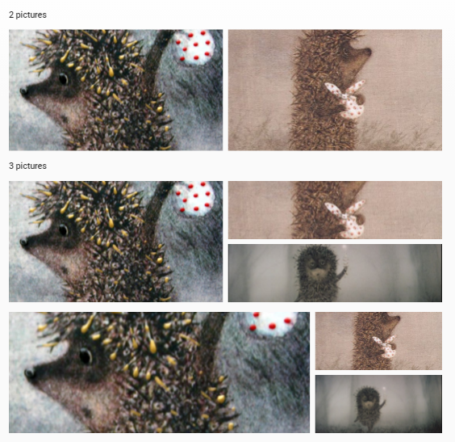
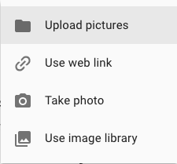
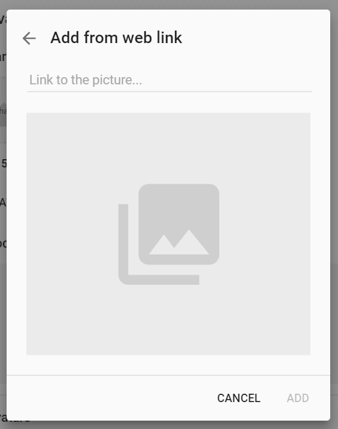

#    Picture controls

Images are essential for any application with graphical user interface. Pip.WebUI.Pictures module provides number of different controls to visualize and edit pictures.

**Picture view** is the simplest control that loads from the server and visualizes a single image. 

**Picture edit** control allows to set a single image and upload it to server.

**Avatar view** control is identical to **Picture view**, the only difference is in URL on the server to upload image.

**Picture list** control allows to upload a collection of images at once. 

**Collage** control visualizes a collection of images as random collage 

**Add picture** dialog let user add image from different sources: from file, camera, web link or image library.

Todo: Add screenshots for every picture dialog except file

## Learn more about the module

- [User's guide](doc/UsersGuide.md)
- [Online samples](http://webui.pipdevs.com/pip-webui-pictures/index.html)
- [API reference](http://webui-api.pipdevs.com/pip-webui-pictures/index.html)
- [Developer's guide](doc/DevelopersGuide.md)
- [Changelog](CHANGELOG.md)
- [Pip.WebUI project website](http://www.pipwebui.org)
- [Pip.WebUI project wiki](https://github.com/pip-webui/pip-webui/wiki)
- [Pip.WebUI discussion forum](https://groups.google.com/forum/#!forum/pip-webui)
- [Pip.WebUI team blog](https://pip-webui.blogspot.com/)

## Module dependencies

* [pip-webui-lib](https://github.com/pip-webui/pip-webui-lib): angular, angular material and other 3rd party libraries
* [pip-webui-css](https://github.com/pip-webui/pip-webui-css): CSS styles and web components
* [pip-webui-core](https://github.com/pip-webui/pip-webui-core): localization and other core services
* [pip-webui-rest](https://github.com/pip-webui/pip-webui-rest): REST resources for files
* [pip-webui-pictures](https://github.com/pip-webui/pip-webui-pictures): user avatar control

## License

This module is released under [MIT license](License) and totally free for commercial and non-commercial use.
