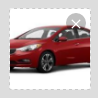
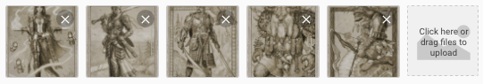
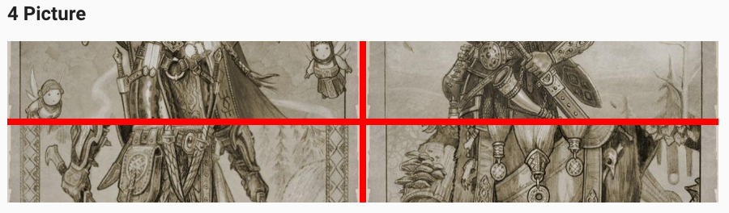
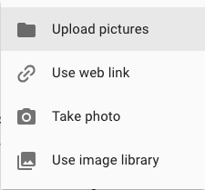
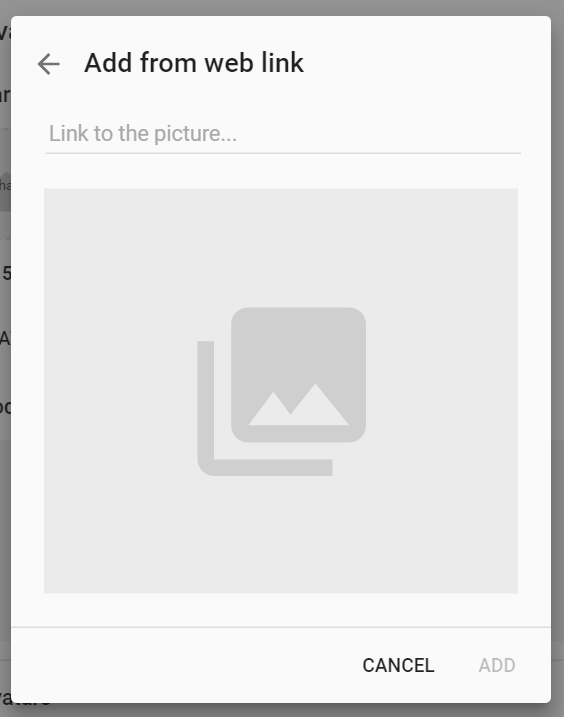
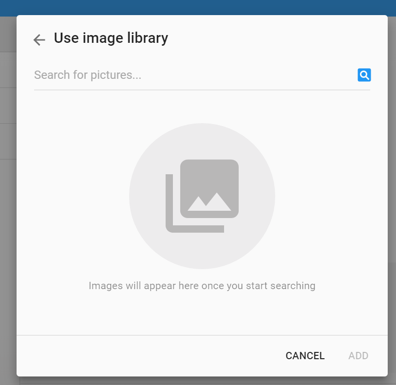

# Pip.WebUI.Pictures User's Guide

## <a name="contents"></a> Contents
- [Installing](#install)
- [pip-picture directive](#picture)
- [pip-picture-edit directive](#picture_edit)
- [pip-avatar directive](#avatar)
- [pip-avatar-edit directive](#avatar_edit)
- [pip-picture-list-edit directive](#picture_list_edit)
- [pip-collage directive](#collage)
- [pip-add-image directive](#add_image)
- [pipCameraDialog](#camera_dialog)
- [pipPictureUrlDialog](#picture_url_dialog)
- [pipGallerySearchDialog](#gallery_search_dialog)
- [Questions and bugs](#issues)


## <a name="install"></a> Installing

Add dependency to **pip-webui** into your **bower.json** or **package.json** file depending what you use.
```javascript
"dependencies": {
  ...
  "pip-webui": "*"
  ...
}
```

Alternatively you can install **pip-webui** manually using **bower**:
```bash
bower install pip-webui
```

or install it using **npm**:
```bash
npm install pip-webui
```

Include **pip-webui** files into your web application.
```html
<link rel="stylesheet" href=".../pip-webui-lib.min.css"/>
<link rel="stylesheet" href=".../pip-webui.min.css"/>
...
<script src=".../pip-webui-lib.min.js"></script>
<script src=".../pip-webui.min.js"></script>
```

Register **pipPictures** module in angular module dependencies.
```javascript
angular.module('myApp',[..., 'pipPictures']);
```


## <a name="picture"></a> pip-picture directive

**pip-picture** directive is the simplest control that loads from the server and visualizes a single image. 
This dialog requires **files** operation in standard REST API. 

### Usage
```html
<pip-picture  pip-picture-id="pictureEditId"></pip-picture>
```


### Attributes
* **pip-picture-id** - id of picture 

## <a name="picture_edit"></a> pip-picture-edit directive

**pip-picture-edit** directive allows to set a single image and upload it to server.
This dialog requires **files** operation in standard REST API. 

### Usage
```html
<pip-picture-edit
     pip-picture-id="pictureEditId"
     pip-party-id="partyId"
     pip-created="onPictureCreated($event)"
     pip-changed="onPictureChanged($control)"
     pip-rebind="true"
     pip-default-text="Change Picture"
     ng-disabled="pictureDisabled">
</pip-picture-edit>
```



### Attributes
Todo: Describe all attributes for this directive 


## <a name="avatar"></a> pip-avatar directive

**pip-avatar** directive is identical to **pip-picture**. The only difference is in URL on the server to upload image.
This dialog requires **files** operation in standard REST API. 

### Usage
```html
 <pip-avatar pip-rebind-avatar="true"
             pip-party-id="avatars[avatarIndex].id"
             pip-party-name="avatars[avatarIndex].name">
 </pip-avatar>
```


### Attributes
* **pip-rebind-avatar** - updating picture in control
* **pip-party-id** - party id
* **pip-party-name** - party name 

## <a name="avatar_edit"></a> pip-avatar-edit directive

**pip-avatar-edit** directive similar to **pip-picture-edit** allows to upload a single image. The only difference is in URL on the server to upload image. This dialog requires **files** operation in standard REST API. 

### Usage
```html
<pip-avatar-edit
        pip-party-id="avatar1.id"
        pip-created="onPictureCreated($event)"
        pip-changed="onPictureChanged($control)"
        pip-default-text="Change avatar"
        pip-reset="isReseting()"
        ng-disabled="pictureDisabled">
</pip-avatar-edit>
```

Todo: Add screenshot for this directive

### Attributes
Todo: Describe all attributes for this directive 


## <a name="picture_list_edit"></a> pip-picture-list-edit directive

**pip-picture-list** directive allows to upload a collection of images at once. 
This dialog requires **files** operation in standard REST API. 

### Usage
```html
<pip-picture-list-edit pip-picture-ids="pictureIds"
                 pip-created="onPictureListCreated($event)"
                 pip-default-text="CLICK_HERE_OR_DRAG_FILES"
                 ng-disabled="pictureListDisabled">
</pip-picture-list-edit>
```



### Attributes
Todo: Describe all attributes for this directive 


## <a name="collage"></a> pip-collage directive

**pip-collage** directive visualizes a collection of images as random collage.
This dialog requires **files** operation in standard REST API. 

### Usage
```html
<pip-collage  pip-srcs="srcs_3"
              pip-multiple="false" 
              pip-unique-code="1"
              pip-open="true">
</pip-collage>
```

Todo: Show collages with different number of images


### Attributes
Todo: Describe all attributes for this directive 


## <a name="add_picture"></a> pip-add-picture directive

**pip-add-picture** directive lets user ability to add image from different sources: from file, camera, web link or image library.
This dialog requires **files** operation in standard REST API. 

### Usage
```html

```
Todo: Add HTML snippet to demonstrate the directive with all attributes

Todo: Add screenshots for every picture dialog except file


### Attributes
Todo: Describe all attributes for this directive 


## <a name="camera_dialog"></a> pipCameraDialog

**pipCameraDialog** allows to add image from integrated camera. If HTML5 camera access is not available this dialog uses portable webcam.js library. Hybrid applications running in Cordova may use native camera application. 

### Usage
Todo: Add code snippet to demonstrate how to open the dialog

Todo: Add screenshot with the dialog

### Methods
Todo: Document the dialog public methods


## <a name="picture_url_dialog"></a> pipPictureUrlDialog

**pipPictureUrlDialog** allows to upload image from external source by its url. The dialog supports only http, https or ftp protocols and jpg, png, gif images. 

### Usage
Todo: Add code snippet to demonstrate how to open the dialog



### Methods
Todo: Document the dialog public methods


## <a name="gallery_search_dialog"></a> pipGallerySearchDialog

**pipGallerySearchDialog** allows to add image from application image gallery or external image search service like Flicker, Google search or Bing. This dialog requires **files**, **imagelib** and **image_sets** operations in standard REST API. 

### Usage
Todo: Add code snippet to demonstrate how to open the dialog



### Methods
Todo: Document the dialog public methods


## <a name="issues"></a> Questions and bugs

If you have any questions regarding the module, you can ask them using our 
[discussion forum](https://groups.google.com/forum/#!forum/pip-webui).

Bugs related to this module can be reported using [github issues](https://github.com/pip-webui/pip-webui-pictures/issues).
